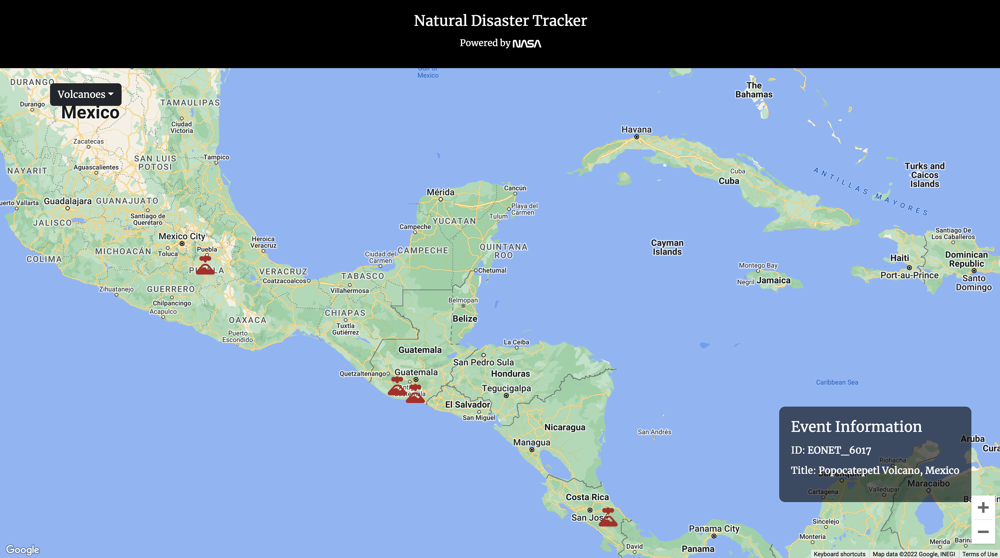

# Natural Disaster Tracker

## About

**Natural Disaster Tracker** (NDT) is a React app that tracks 7 categories of natural events or disasters all around the world by retrieving the event metadata from NASA EONET API and mapping them to Google Maps. NDT also displays the EONET ID and title of each event when the marker on the map is clicked.

The 7 categories of natural disasters tracked:

1. Wildfire
2. Volcano
3. Flood
4. Severe storm
5. Drought
6. Earthquake
7. Landslide

NDT expands Brad Traversy's [Wildfire Tracker](https://github.com/bradtraversy/wildfire-tracker) by adding:

- Six other disasters
- A responsive display for different viewports
- An interactive dropdown menu for an enhanced UX

## Demo

Check out Natural Disaster Tracker in action: [trackdisaster.netlify.app](https://trackdisaster.netlify.app)

## Credit

[Wildfire Tracker](https://github.com/bradtraversy/wildfire-tracker) by Brad Traversy
